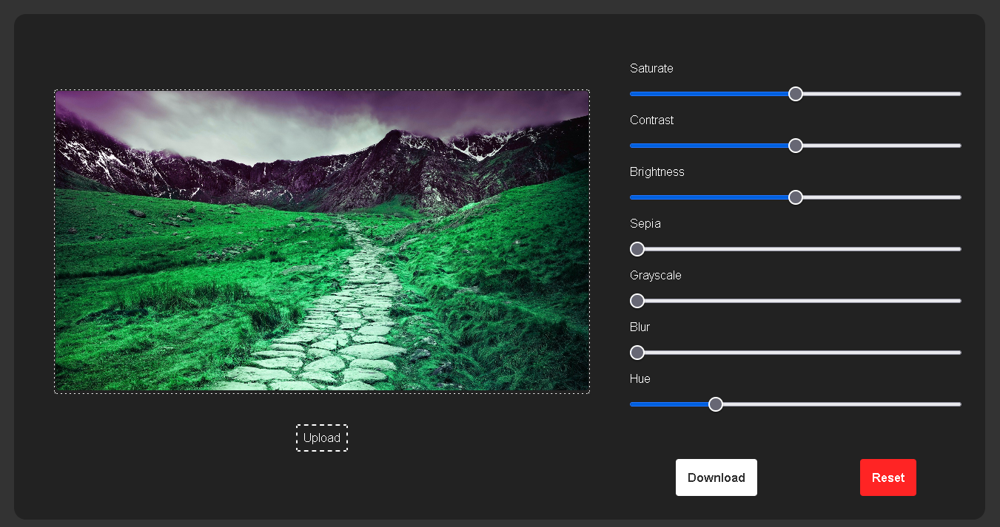
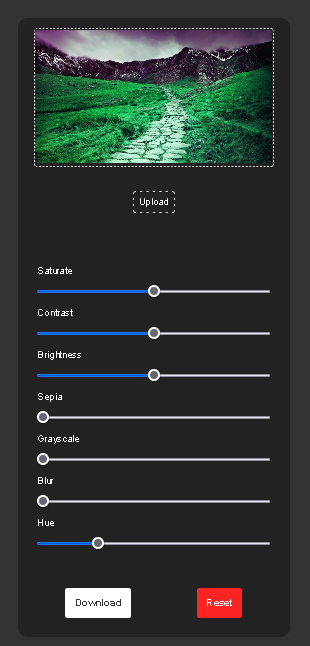

# Image Editor

> Simple Image Editor that can be used to adjust the image values like brightness, contrast, hue, saturation, grayscale and sepia. Image editors allow one to quickly edit pictures after they have been captured for enhancing them or completely changing their look. Using a combination of various values, one can give an image a completely new look.

## Built With

- HTML
- Css
- JavaScript

## Live Demo (if available)

[Live Demo](https://muhmmdusama.github.io/)

## Authors

##👤 Author

- GitHub: [@muhmmdusama](https://github.com/muhmmdusama)
- Twitter: [@muhmmdusama](https://twitter.com/muhmmdusama)
- LinkedIn: [muhmmdusama](https://linkedin.com/in/muhmmdusama)

## 🤝 Contributing

Contributions, issues, and feature requests are welcome!

## Show your support

Give a ⭐️ if you like this project!

## 📝 License

This project is [MIT](./MIT.md) licensed.
